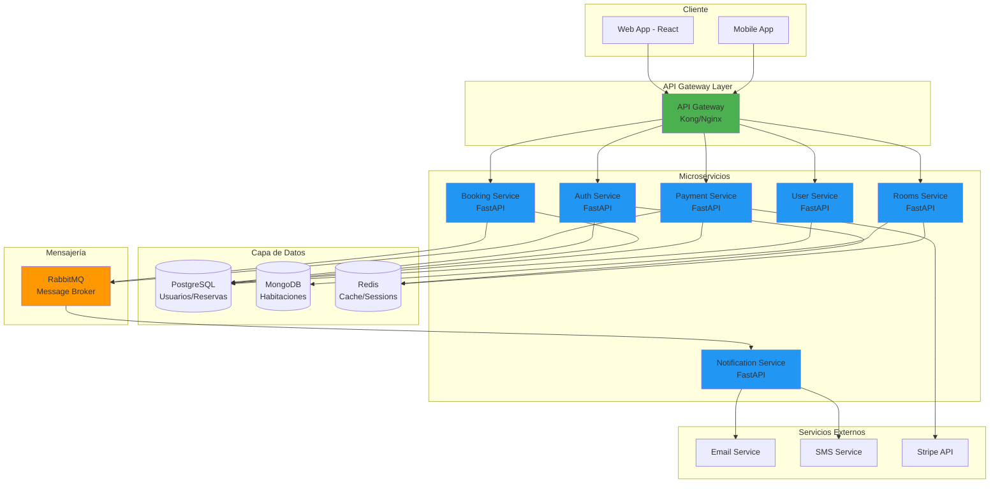
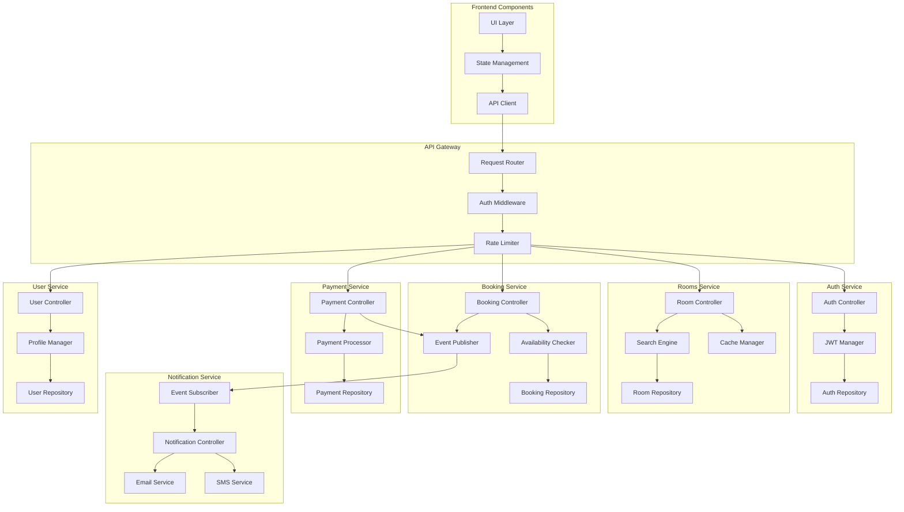
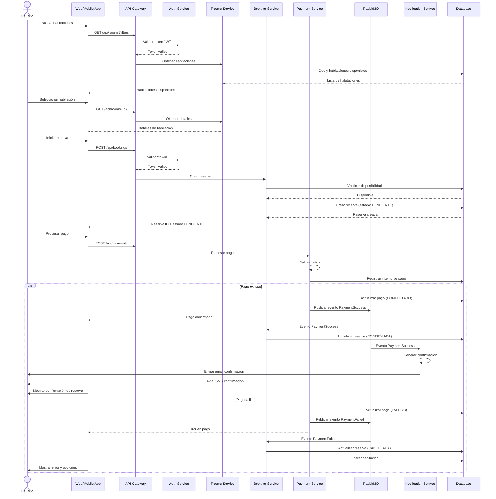
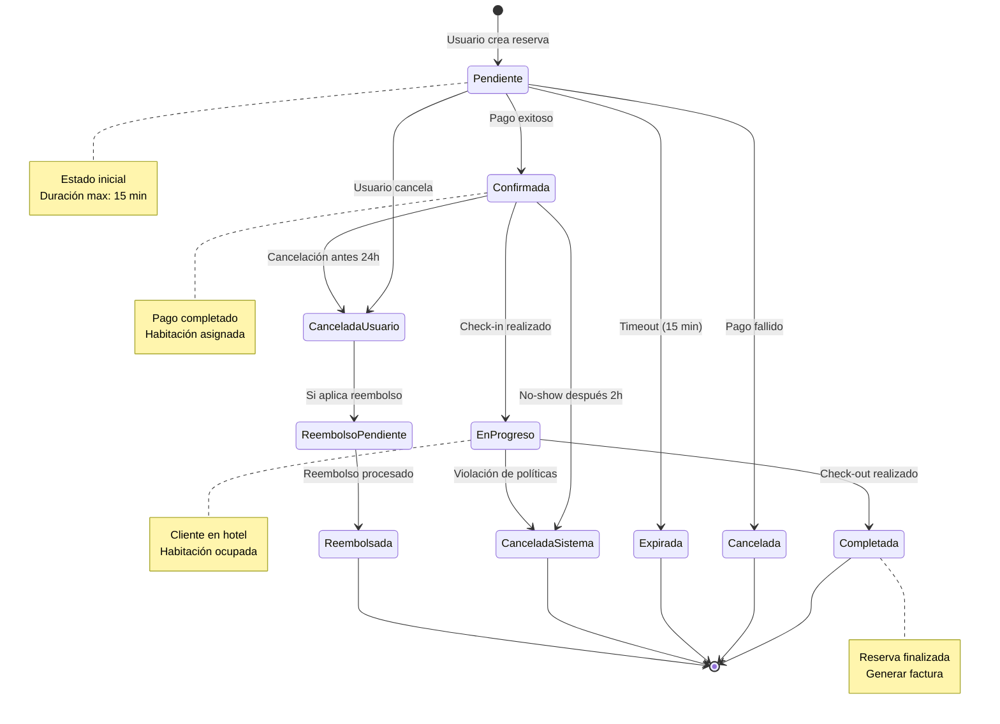

# Sistema de Reservas de Hotel

## Qué es esto?

Básicamente es un sistema para reservar habitaciones de hotel, pero hecho con microservicios para que sea más fácil de mantener y escalar.

### La idea principal

- Cada cosa tiene su propio servicio (autenticación, pagos, reservas, etc)
- Si una parte se cae, las demás siguen funcionando
- Puedo escalar solo lo que necesito (ej: si hay mucho tráfico en búsqueda de habitaciones, solo escalo ese servicio)
- Uso caché y mensajería asíncrona para que no sea lento

## Arquitectura

Cómo está armado todo:



## Componentes internos

Cómo están organizadas las cosas por dentro de cada servicio:



## Flujo de una reserva

Cómo funciona cuando alguien hace una reserva (paso a paso):



## Estados de una reserva

Por dónde pasa una reserva desde que se crea hasta que termina:



## Diseños de pantallas

Usé Uizard para hacer los mockups rápido. Aquí están las pantallas principales:

### Login / Registro

Prompt que usé:
```
Create a modern hotel booking login and registration screen with:
- Clean, minimal design with hotel imagery background
- Email and password fields for login
- "Sign in with Google" button
- "Create account" option
- Forgot password link
- Mobile responsive layout
- Color scheme: blue and white professional theme
```

Lo que tiene:
- Login normal con email/contraseña
- Botón para registrarse
- Login con Google/Facebook
- Funciona en móvil y desktop

### Búsqueda de habitaciones

Prompt:
```
Design a hotel room search and listing page with:
- Search bar with filters: dates, guests, room type, price range
- Grid/list view toggle
- Room cards showing: image, name, price per night, rating, amenities icons
- Sorting options: price, rating, popularity
- Filter sidebar: price range, bed type, amenities checkboxes
- Map view option
- Responsive design for desktop and mobile
- Modern, clean interface with blue accent colors
```

Tiene:
- Buscador con filtros (fechas, personas, tipo de cuarto, precio)
- Cards con foto, precio y rating
- Puedes ver en lista o cuadrícula
- Filtros a un lado para afinar la búsqueda

### Detalle de habitación

Prompt:
```
Create a hotel room detail page with booking form including:
- Large image gallery/carousel at top
- Room name, description, and key features
- Amenities list with icons (WiFi, AC, TV, etc.)
- Price breakdown section
- Booking form widget: check-in/out dates, guests selector
- "Reserve Now" prominent button
- Guest reviews section with ratings
- Hotel policies and cancellation info
- Responsive layout for mobile and desktop
- Professional blue and white color scheme
```

Incluye:
- Fotos de la habitación
- Descripción y servicios (wifi, AC, etc)
- Selector de fechas y cuántas personas
- Precio desglosado
- Botón grande de "Reservar"
- Reviews de otros usuarios

### Confirmación

Prompt:
```
Design a booking confirmation screen with:
- Success checkmark icon or animation
- Booking reference number prominently displayed
- Summary card: room details, dates, guests, total price
- Payment confirmation status
- Email confirmation sent message
- "Download receipt" button
- "View my bookings" button
- QR code for check-in
- Support contact information
- Clean, celebratory design with green success color
- Mobile responsive layout
```

Muestra:
- Un check verde de éxito
- Número de confirmación
- Resumen de todo (fechas, precio, etc)
- Info del pago
- Opción de descargar o enviar por email
- QR para hacer check-in
- Link para ver mis otras reservas

### Screenshots

Las imágenes van en `/docs/ui/`. Para generarlas vas a Uizard, creas proyecto con IA, usas los prompts de arriba y exportas.

```
📁 docs/
  📁 ui/
    📄 01-login-register.png
    📄 02-room-search-listing.png
    📄 03-room-detail-booking.png
    📄 04-booking-confirmation.png
```

## Stack tecnológico

Qué usé y por qué:

### Backend
- **FastAPI** - Es rápido, moderno, y genera la documentación automáticamente. Además soporta async que viene bien para microservicios.

### Bases de datos
- **PostgreSQL** - Para usuarios, reservas y pagos. Porque necesito transacciones sólidas (ACID) para los pagos.
- **MongoDB** - Para el catálogo de habitaciones. Es flexible por si cada hotel tiene habitaciones diferentes.
- **Redis** - Cache para que sea rápido. También para las sesiones.

### Mensajería
- **RabbitMQ** - Para comunicación asíncrona entre servicios. Cuando se hace un pago, por ejemplo, el servicio de notificaciones se entera y manda el email.

### Frontend
- **React** - Porque es lo que más se usa y tiene un montón de librerías disponibles.

### Infraestructura
- **Docker** - Para tener todo en containers
- **Docker Compose** - Para levantar todo fácil en local
- **Nginx** - Como API Gateway

---

## 📁 Estructura del Proyecto

```
hotel-reservation-microservices/
├── services/
│   ├── auth-service/
│   │   ├── app/
│   │   │   ├── __init__.py
│   │   │   ├── main.py
│   │   │   ├── models.py
│   │   │   ├── schemas.py
│   │   │   ├── routes.py
│   │   │   └── config.py
│   │   ├── requirements.txt
│   │   └── Dockerfile
│   │
│   ├── rooms-service/
│   │   ├── app/
│   │   │   ├── __init__.py
│   │   │   ├── main.py
│   │   │   ├── models.py
│   │   │   ├── schemas.py
│   │   │   ├── routes.py
│   │   │   └── config.py
│   │   ├── requirements.txt
│   │   └── Dockerfile
│   │
│   ├── booking-service/
│   │   ├── app/
│   │   │   ├── __init__.py
│   │   │   ├── main.py
│   │   │   ├── models.py
│   │   │   ├── schemas.py
│   │   │   ├── routes.py
│   │   │   └── config.py
│   │   ├── requirements.txt
│   │   └── Dockerfile
│   │
│   ├── payment-service/
│   │   ├── app/
│   │   │   ├── __init__.py
│   │   │   ├── main.py
│   │   │   ├── models.py
│   │   │   ├── schemas.py
│   │   │   ├── routes.py
│   │   │   └── config.py
│   │   ├── requirements.txt
│   │   └── Dockerfile
│   │
│   ├── notification-service/
│   │   ├── app/
│   │   │   ├── __init__.py
│   │   │   ├── main.py
│   │   │   ├── consumers.py
│   │   │   ├── email_service.py
│   │   │   └── config.py
│   │   ├── requirements.txt
│   │   └── Dockerfile
│   │
│   └── user-service/
│       ├── app/
│       │   ├── __init__.py
│       │   ├── main.py
│       │   ├── models.py
│       │   ├── schemas.py
│       │   ├── routes.py
│       │   └── config.py
│       ├── requirements.txt
│       └── Dockerfile
│
├── frontend/
│   ├── src/
│   │   ├── components/
│   │   ├── pages/
│   │   ├── services/
│   │   ├── store/
│   │   └── App.jsx
│   └── package.json
│
├── infrastructure/
│   ├── docker-compose.yml
│   ├── kubernetes/
│   └── nginx/
│
├── docs/
│   └── ui/
│
└── README.md
```

## Cómo correrlo

### Necesitas tener instalado
- Docker y Docker Compose
- Python 3.11+
- Node.js 18+

### Para levantarlo local

1. Clonar
```bash
git clone https://github.com/tu-usuario/hotel-reservation-microservices.git
cd hotel-reservation-microservices
```

2. Levantar todo con Docker
```bash
cd infrastructure
docker-compose up -d
```

3. Listo, ya está corriendo:
- API Gateway: http://localhost:8000
- Auth Service: http://localhost:8001
- Rooms Service: http://localhost:8002
- Booking Service: http://localhost:8003
- Payment Service: http://localhost:8004
- Frontend: http://localhost:3000

## Endpoints principales

Lo más importante de cada servicio:

### Auth Service
- `POST /api/auth/register` - Registro de usuario
- `POST /api/auth/login` - Login
- `POST /api/auth/refresh` - Refresh token
- `POST /api/auth/logout` - Logout

### Rooms Service
- `GET /api/rooms` - Listar habitaciones
- `GET /api/rooms/{id}` - Detalle de habitación
- `GET /api/rooms/search` - Buscar habitaciones
- `POST /api/rooms` - Crear habitación (admin)

### Booking Service
- `POST /api/bookings` - Crear reserva
- `GET /api/bookings/{id}` - Detalle de reserva
- `GET /api/bookings/user/{user_id}` - Reservas de usuario
- `PATCH /api/bookings/{id}/cancel` - Cancelar reserva

### Payment Service
- `POST /api/payments` - Procesar pago
- `GET /api/payments/{id}` - Detalle de pago
- `POST /api/payments/refund` - Procesar reembolso

### User Service
- `GET /api/users/{id}` - Perfil de usuario
- `PATCH /api/users/{id}` - Actualizar perfil
- `GET /api/users/{id}/bookings` - Reservas del usuario

## Seguridad

Cosas que implementé:
- JWT para autenticación
- Bcrypt para hashear contraseñas
- Rate limiting para evitar ataques
- CORS configurado
- Validación de inputs con Pydantic
- SQLAlchemy ORM para evitar SQL injection

## Cosas que podría agregar después

- Deploy en Kubernetes para producción
- Prometheus + Grafana para monitoreo
- Logs centralizados con ELK
- Versionado de API
- GraphQL como alternativa a REST
- ML para recomendaciones
- Soporte multi-hotel

---

## 👥 Contribuciones

Las contribuciones son bienvenidas. Por favor:
1. Fork el proyecto
2. Crea una rama para tu feature (`git checkout -b feature/AmazingFeature`)
3. Commit tus cambios (`git commit -m 'Add some AmazingFeature'`)
4. Push a la rama (`git push origin feature/AmazingFeature`)
5. Abre un Pull Request

## Licencia

MIT

---

Hecho como tarea de Diseño y Arquitectura de Microservicios
