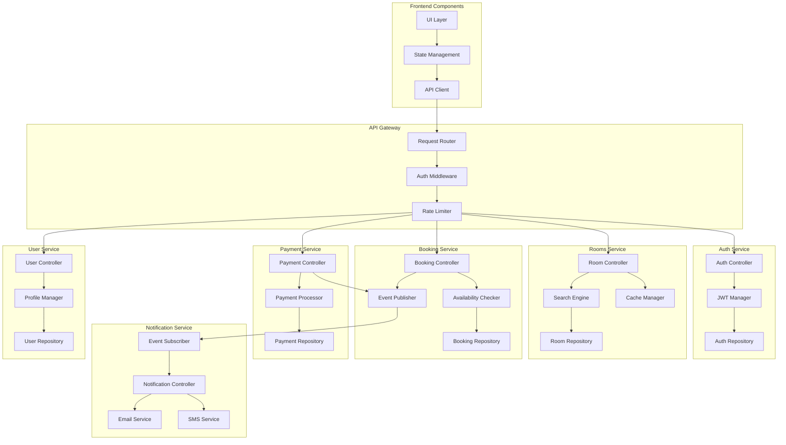

# Sistema de Reservas de Hotel

## Qué es esto?

Básicamente es un sistema para reservar habitaciones de hotel, pero hecho con microservicios para que sea más fácil de mantener y escalar.

### La idea principal

- Cada cosa tiene su propio servicio (autenticación, pagos, reservas, etc)
- Si una parte se cae, las demás siguen funcionando
- Puedo escalar solo lo que necesito (ej: si hay mucho tráfico en búsqueda de habitaciones, solo escalo ese servicio)
- Uso caché y mensajería asíncrona para que no sea lento

## Arquitectura

Cómo está armado todo:

```mermaid
graph TB
    subgraph "Cliente"
        WEB[Web App - React]
        MOBILE[Mobile App]
    end

    subgraph "API Gateway Layer"
        GATEWAY[API Gateway<br/>Kong/Nginx]
    end

    subgraph "Microservicios"
        AUTH[Auth Service<br/>FastAPI]
        ROOMS[Rooms Service<br/>FastAPI]
        BOOKING[Booking Service<br/>FastAPI]
        PAYMENT[Payment Service<br/>FastAPI]
        NOTIF[Notification Service<br/>FastAPI]
        USER[User Service<br/>FastAPI]
    end

    subgraph "Capa de Datos"
        POSTGRES[(PostgreSQL<br/>Usuarios/Reservas)]
        MONGO[(MongoDB<br/>Habitaciones)]
        REDIS[(Redis<br/>Cache/Sessions)]
    end

    subgraph "Mensajería"
        RABBITMQ[RabbitMQ<br/>Message Broker]
    end

    subgraph "Servicios Externos"
        EMAIL[Email Service]
        SMS[SMS Service]
        STRIPE[Stripe API]
    end

    WEB --> GATEWAY
    MOBILE --> GATEWAY
    
    GATEWAY --> AUTH
    GATEWAY --> ROOMS
    GATEWAY --> BOOKING
    GATEWAY --> PAYMENT
    GATEWAY --> USER

    AUTH --> POSTGRES
    AUTH --> REDIS
    
    ROOMS --> MONGO
    ROOMS --> REDIS
    
    BOOKING --> POSTGRES
    BOOKING --> RABBITMQ
    
    PAYMENT --> POSTGRES
    PAYMENT --> STRIPE
    PAYMENT --> RABBITMQ
    
    USER --> POSTGRES
    
    RABBITMQ --> NOTIF
    NOTIF --> EMAIL
    NOTIF --> SMS

    style GATEWAY fill:#4CAF50
    style AUTH fill:#2196F3
    style ROOMS fill:#2196F3
    style BOOKING fill:#2196F3
    style PAYMENT fill:#2196F3
    style NOTIF fill:#2196F3
    style USER fill:#2196F3
    style RABBITMQ fill:#FF9800
```



## Componentes internos

Cómo están organizadas las cosas por dentro de cada servicio:



## Flujo de una reserva

Cómo funciona cuando alguien hace una reserva (paso a paso):

```mermaid
sequenceDiagram
    actor Usuario
    participant UI as Web/Mobile App
    participant GW as API Gateway
    participant Auth as Auth Service
    participant Rooms as Rooms Service
    participant Booking as Booking Service
    participant Payment as Payment Service
    participant MQ as RabbitMQ
    participant Notif as Notification Service
    participant DB as Database

    Usuario->>UI: Buscar habitaciones
    UI->>GW: GET /api/rooms?filters
    GW->>Auth: Validar token JWT
    Auth-->>GW: Token válido
    GW->>Rooms: Obtener habitaciones
    Rooms->>DB: Query habitaciones disponibles
    DB-->>Rooms: Lista de habitaciones
    Rooms-->>UI: Habitaciones disponibles

    Usuario->>UI: Seleccionar habitación
    UI->>GW: GET /api/rooms/{id}
    GW->>Rooms: Obtener detalles
    Rooms-->>UI: Detalles de habitación

    Usuario->>UI: Iniciar reserva
    UI->>GW: POST /api/bookings
    GW->>Auth: Validar token
    Auth-->>GW: Token válido
    GW->>Booking: Crear reserva
    
    Booking->>DB: Verificar disponibilidad
    DB-->>Booking: Disponible
    Booking->>DB: Crear reserva (estado: PENDIENTE)
    DB-->>Booking: Reserva creada
    Booking-->>UI: Reserva ID + estado PENDIENTE

    Usuario->>UI: Procesar pago
    UI->>GW: POST /api/payments
    GW->>Payment: Procesar pago
    Payment->>Payment: Validar datos
    Payment->>DB: Registrar intento de pago
    
    alt Pago exitoso
        Payment->>DB: Actualizar pago (COMPLETADO)
        Payment->>MQ: Publicar evento PaymentSuccess
        Payment-->>UI: Pago confirmado
        
        MQ->>Booking: Evento PaymentSuccess
        Booking->>DB: Actualizar reserva (CONFIRMADA)
        
        MQ->>Notif: Evento PaymentSuccess
        Notif->>Notif: Generar confirmación
        Notif->>Usuario: Enviar email confirmación
        Notif->>Usuario: Enviar SMS confirmación
        
        UI->>Usuario: Mostrar confirmación de reserva
    else Pago fallido
        Payment->>DB: Actualizar pago (FALLIDO)
        Payment->>MQ: Publicar evento PaymentFailed
        Payment-->>UI: Error en pago
        
        MQ->>Booking: Evento PaymentFailed
        Booking->>DB: Actualizar reserva (CANCELADA)
        Booking->>DB: Liberar habitación
        
        UI->>Usuario: Mostrar error y opciones
    end
```



## Estados de una reserva

Por dónde pasa una reserva desde que se crea hasta que termina:

```mermaid
stateDiagram-v2
    [*] --> Pendiente: Usuario crea reserva
    
    Pendiente --> Confirmada: Pago exitoso
    Pendiente --> Cancelada: Pago fallido
    Pendiente --> Expirada: Timeout (15 min)
    Pendiente --> CanceladaUsuario: Usuario cancela
    
    Confirmada --> EnProgreso: Check-in realizado
    Confirmada --> CanceladaUsuario: Cancelación antes 24h
    Confirmada --> CanceladaSistema: No-show después 2h
    
    EnProgreso --> Completada: Check-out realizado
    EnProgreso --> CanceladaSistema: Violación de políticas
    
    Completada --> [*]
    Cancelada --> [*]
    Expirada --> [*]
    CanceladaUsuario --> ReembolsoPendiente: Si aplica reembolso
    CanceladaSistema --> [*]
    
    ReembolsoPendiente --> Reembolsada: Reembolso procesado
    Reembolsada --> [*]

    note right of Pendiente
        Estado inicial
        Duración max: 15 min
    end note

    note right of Confirmada
        Pago completado
        Habitación asignada
    end note

    note right of EnProgreso
        Cliente en hotel
        Habitación ocupada
    end note

    note right of Completada
        Reserva finalizada
        Generar factura
    end note
```



## Diseños de pantallas

Usé Uizard para hacer los mockups rápido. Aquí están las pantallas principales:

### Login / Registro

Prompt que usé:
```
Create a modern hotel booking login and registration screen with:
- Clean, minimal design with hotel imagery background
- Email and password fields for login
- "Sign in with Google" button
- "Create account" option
- Forgot password link
- Mobile responsive layout
- Color scheme: blue and white professional theme
```

Lo que tiene:
- Login normal con email/contraseña
- Botón para registrarse
- Login con Google/Facebook
- Funciona en móvil y desktop

### Búsqueda de habitaciones

Prompt:
```
Design a hotel room search and listing page with:
- Search bar with filters: dates, guests, room type, price range
- Grid/list view toggle
- Room cards showing: image, name, price per night, rating, amenities icons
- Sorting options: price, rating, popularity
- Filter sidebar: price range, bed type, amenities checkboxes
- Map view option
- Responsive design for desktop and mobile
- Modern, clean interface with blue accent colors
```

Tiene:
- Buscador con filtros (fechas, personas, tipo de cuarto, precio)
- Cards con foto, precio y rating
- Puedes ver en lista o cuadrícula
- Filtros a un lado para afinar la búsqueda

### Detalle de habitación

Prompt:
```
Create a hotel room detail page with booking form including:
- Large image gallery/carousel at top
- Room name, description, and key features
- Amenities list with icons (WiFi, AC, TV, etc.)
- Price breakdown section
- Booking form widget: check-in/out dates, guests selector
- "Reserve Now" prominent button
- Guest reviews section with ratings
- Hotel policies and cancellation info
- Responsive layout for mobile and desktop
- Professional blue and white color scheme
```

Incluye:
- Fotos de la habitación
- Descripción y servicios (wifi, AC, etc)
- Selector de fechas y cuántas personas
- Precio desglosado
- Botón grande de "Reservar"
- Reviews de otros usuarios

### Confirmación

Prompt:
```
Design a booking confirmation screen with:
- Success checkmark icon or animation
- Booking reference number prominently displayed
- Summary card: room details, dates, guests, total price
- Payment confirmation status
- Email confirmation sent message
- "Download receipt" button
- "View my bookings" button
- QR code for check-in
- Support contact information
- Clean, celebratory design with green success color
- Mobile responsive layout
```

Muestra:
- Un check verde de éxito
- Número de confirmación
- Resumen de todo (fechas, precio, etc)
- Info del pago
- Opción de descargar o enviar por email
- QR para hacer check-in
- Link para ver mis otras reservas

### Screenshots

Las imágenes van en `/docs/ui/`. Para generarlas vas a Uizard, creas proyecto con IA, usas los prompts de arriba y exportas.

```
 📁 docs/
   📁 ui/
     📄 https://github.com/danilamgallo-star/hotel-reservation-microservices/blob/main/docs/ui/01-login-register.png
     📄 https://github.com/danilamgallo-star/hotel-reservation-microservices/blob/main/docs/ui/02-search.png
```

## Stack tecnológico

Qué usé y por qué:

### Backend
- **FastAPI** - Es rápido, moderno, y genera la documentación automáticamente. Además soporta async que viene bien para microservicios.

### Bases de datos
- **PostgreSQL** - Para usuarios, reservas y pagos. Porque necesito transacciones sólidas (ACID) para los pagos.
- **MongoDB** - Para el catálogo de habitaciones. Es flexible por si cada hotel tiene habitaciones diferentes.
- **Redis** - Cache para que sea rápido. También para las sesiones.

### Mensajería
- **RabbitMQ** - Para comunicación asíncrona entre servicios. Cuando se hace un pago, por ejemplo, el servicio de notificaciones se entera y manda el email.

### Frontend
- **React** - Porque es lo que más se usa y tiene un montón de librerías disponibles.

### Infraestructura
- **Docker** - Para tener todo en containers
- **Docker Compose** - Para levantar todo fácil en local
- **Nginx** - Como API Gateway

